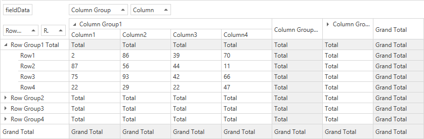

<!-- default badges list -->

[](https://supportcenter.devexpress.com/ticket/details/T555636)
[](https://docs.devexpress.com/GeneralInformation/403183)
[](#does-this-example-address-your-development-requirementsobjectives)
<!-- default badges end -->

# Pivot Grid for WPF - How to Specify Custom Summary Values for Total, Grand Total, and Ordinary Cells

This example demonstrates how to determine the value type when you calculate custom summary values.



<!-- default file list -->
## Files to Review

* [MainWindow.xaml](./CS/WpfApplication1/MainWindow.xaml) (VB: [MainWindow.xaml](./VB/WpfApplication1/MainWindow.xaml))
* [MyDataContext.cs](./CS/WpfApplication1/MyDataContext.cs) (VB: [MyDataContext.vb](./VB/WpfApplication1/MyDataContext.vb))
<!-- default file list end -->

## Example Overview

Follow the steps below to create a custom summary.
1. Create an [ExpressionDataBinding](https://docs.devexpress.com/WPF/DevExpress.Xpf.PivotGrid.ExpressionDataBinding?p=netframework) object.
2. Pass the following expression in its constructor as a parameter:

    ```
    iif(IsTotal([fieldColumnGroup]),'Grand Total',IsTotal([fieldRowGroup]),'Grand Total',IsTotal([fieldColumn]),'Total',IsTotal([fieldRow]),'Total',Sum([Data]))
    ``` 
3. Assign the `ExpressionDataBinding` instance to the _fieldData_ field's [DataBinding](https://docs.devexpress.com/WPF/DevExpress.Xpf.PivotGrid.PivotGridField.DataBinding?p=netframework) property.

## Documentation

- [Pivot Grid Expression Syntax](https://docs.devexpress.com/CoreLibraries/120512/devexpress-pivot-grid-core-library/advanced-analytics/pivot-grid-expression-syntax#functions)
- [Custom Summaries](https://docs.devexpress.com/WPF/8052/controls-and-libraries/pivot-grid/data-shaping/aggregation/summaries/custom-summaries)

## More Examples

[How to Create a Custom Summary to Display the Distinct Value Count](https://github.com/DevExpress-Examples/how-to-implement-custom-summary-e2136)


<!-- feedback -->
## Does this example address your development requirements/objectives?

[](https://www.devexpress.com/support/examples/survey.xml?utm_source=github&utm_campaign=wpf-pivot-grid-provide-custom-summary-values&~~~was_helpful=yes) [](https://www.devexpress.com/support/examples/survey.xml?utm_source=github&utm_campaign=wpf-pivot-grid-provide-custom-summary-values&~~~was_helpful=no)

(you will be redirected to DevExpress.com to submit your response)
<!-- feedback end -->
